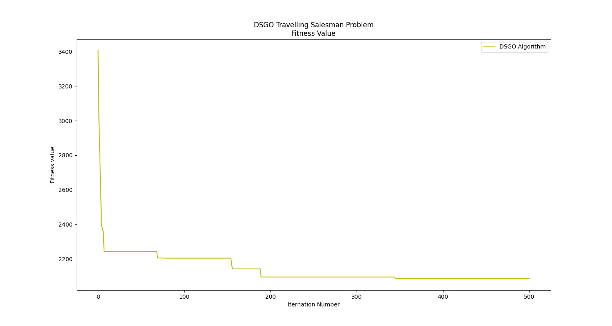

# Solving the Travelling Salesman Problem Using Discreet Social Group Optimization

## Overview

This project demonstrates the application of Discreet Social Group Optimization (DSGO) to solve the Travelling Salesman Problem (TSP), a classical optimization problem. DSGO, inspired by social group dynamics, is employed to explore the search space and find an optimal solution.

## Key Concepts

- **Travelling Salesman Problem (TSP)**: Find the shortest route that visits each city once and returns to the starting point.
- **Discreet Social Group Optimization (DSGO)**: A metaheuristic algorithm that mimics social interaction to improve solution quality.

## Approach

- **Initialization**: Generate a population of candidate routes.
- **Social Interaction**: Agents share their best solutions to promote beneficial paths.
- **Improving Phase**: Individuals in the group enhance their knowledge by being influenced by the best-performing person, who has the highest problem-solving capacity.
- **Acquiring Phase**: Each individual further improves their knowledge through mutual interaction with others in the group, including the best person.
- **Convergence**: The algorithm iterates until a stopping criterion is met.

## Results

The algorithm was tested on standard TSP datasets and showed competitive performance in solution quality and convergence speed.

The simulation run on the `GR17` dataset is illustrated with a convergence graph, showcasing the performance over time. This visual representation highlights how the solution evolves and improves as the algorithm progresses.



```
Evaluating Discreet Social Group Optimization
Working...: 100%|█████████████████████████████████████████████████████| 501/501 [00:10<00:00, 47.37it/s]
Solution from DSGO: [1, 16, 12, 9, 4, 13, 17, 14, 15, 10, 2, 5, 11, 3, 6, 8, 7]
Total Distance (DSGO): 2090
Optimal Solution [1, 4, 13, 7, 8, 6, 17, 14, 15, 3, 11, 10, 2, 5, 9, 12, 16]
Total Distance (Optimal) 2085
```

## Requirements

- Python 3.x
- Libraries: `numpy`, `matplotlib`, `tqdm`

## Usage

1. Clone the repository:
   ```
   git clone https://github.com/rpd-512/dsgo-travelling-salesman-problem.git
   cd dsgo-travelling-salesman-problem/
   ```
2. Install dependencies
   ```
   pip3 install -r requirements.txt
   ```
3. Run the algorithm
   ```
   python3 main.py
   ```

## References
[Solving Travelling Salesman Problem using Discreet Social Group Optimization](https://pdfs.semanticscholar.org/60e8/95a32a11db535dfb850d5487c9368f96fbb2.pdf) by Sumit Verma et al.
